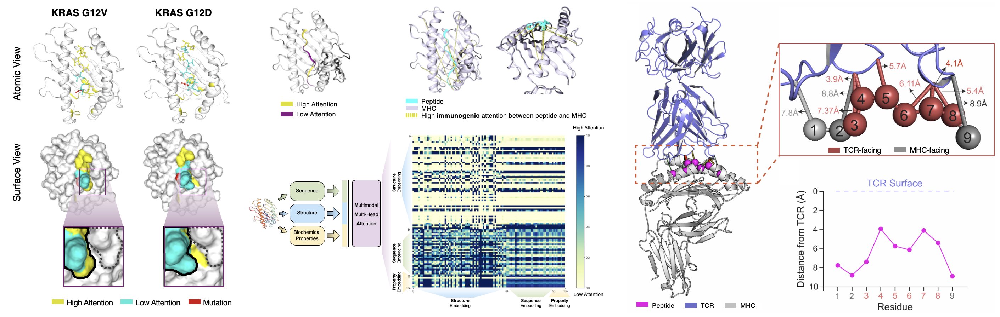

<a id="readme-top"></a>

<!-- PROJECT LOGO -->

<div align="center">
  <h1><br><code>ImmunoStruct</code></h1>
  <h3>ImmunoStruct enables multimodal deep learning for immunogenicity prediction</h3>

  [](https://www.nature.com/articles/s42256-025-01163-y)
  [](https://www.nature.com/articles/s42256-025-01163-y.pdf)
  [](https://huggingface.co/datasets/ChenLiu1996/ImmunoStruct)
  [](https://huggingface.co/ChenLiu1996/ImmunoStruct)
  [](https://github.com/KrishnaswamyLab/ImmunoStruct)
  <br>[](https://www.linkedin.com/in/kevin-bijan-givechian-phd-36467ba3/)
  [](https://www.linkedin.com/in/joao-felipe-rocha/)
  [](https://www.linkedin.com/in/chenliu1996/)
  [](https://scholar.google.com/citations?user=3rDjnykAAAAJ&sortby=pubdate)
  <br>[](https://x.com/KevinGivechian)
  [](https://x.com/ChenLiu_1996)
  [](https://x.com/KrishnaswamyLab)

</div>

Project leads: [Kevin Bijan Givechian](https://www.linkedin.com/in/kevin-bijan-givechian-phd-36467ba3/), [João Felipe Rocha](https://www.linkedin.com/in/joao-felipe-rocha/), [Chen Liu](https://www.linkedin.com/in/chenliu1996/).
<br>Correspondence: `akiko.iwasaki@yale.edu`, `smita.krishnaswamy@yale.edu`.

<br>In case you don't have access to Nature, here are the [main paper](pdf/ImmunoStruct_NMI.pdf) and the [supplementary materials](pdf/ImmunoStruct_NMI_supp.pdf).

<!-- TABLE OF CONTENTS -->
<details>
  <summary>Table of Contents</summary>
  <ol>
    <li><a href="#news">News</a></li>
    <li><a href="#about-the-project">About The Project</a></li>
    <li><a href="#citation">Citation</a></li>
    <li><a href="#getting-started">Getting Started</a></li>
    <li><a href="#usage">Usage</a></li>
    <li><a href="#troubleshooting">Troubleshooting</a></li>
    <li><a href="#license">License</a></li>
    <li><a href="#contact">Contact</a></li>
  </ol>
</details>

## News

News in English<br>
[](https://medicine.yale.edu/news-article/using-machine-learning-to-develop-personalized-vaccines-for-cancer/)
[-white)](https://time.news/machine-learning-immune-system-personalized-medicine-clues/)
[-white)](https://time.news/ai-improves-personalized-cancer-vaccine-design-yale-study/)
[](https://www.innovitaresearch.com/2026/03/04/using-machine-learning-to-develop-personalized-vaccines-for-cancer/)
[](https://medicalxpress.com/news/2026-02-personalized-vaccines-cancer-machine.html)
[](https://www.technology.org/2026/03/04/using-machine-learning-to-develop-personalized-vaccines-for-cancer/)
[](https://decodingbio.substack.com/p/biobyte-144-a-virtual-model-of-cell)
[](https://bioengineer.org/immunostruct-advancing-deep-learning-in-immunogenicity-prediction/)
[](https://www.geneonline.com/deep-learning-model-immunostruct-developed-to-improve-prediction-of-immunogenic-epitopes-for-vaccine-research/)
<br>[](https://en.wikipedia.org/wiki/Immunogenicity)


News in Chinese<br>
[](https://www.163.com/dy/article/KJ13HJ340511ABV6.html)
[-white)](https://cloud.tencent.com/developer/article/2612794)
<br>[](https://m.sohu.com/a/974949014_473283)
[](https://hub.baai.ac.cn/view/51813)
[](https://finance.sina.com.cn/stock/t/2026-01-11/doc-inhfxvtm9135944.shtml)
[](https://www.aizws.net/news/detail/6922)
[](https://baijiahao.baidu.com/s?id=1854022994702774585)
<br>[](https://baike.baidu.com/item/%E5%85%8D%E7%96%AB%E5%8E%9F%E6%80%A7/5292060)
[](https://baike.baidu.com/item/%E5%9B%BE%E7%A5%9E%E7%BB%8F%E7%BD%91%E7%BB%9C/59091829)


&#9744; TODO: create and release an end-to-end tool.
<br>&#x2705; Feb 20, 2026: The [multimodal datasets](https://huggingface.co/datasets/ChenLiu1996/ImmunoStruct) and [model weights](https://huggingface.co/ChenLiu1996/ImmunoStruct) are now open-sourced. See [instructions](https://github.com/KrishnaswamyLab/ImmunoStruct?tab=readme-ov-file#data-preparation).
<br>&#x2705; Dec 31, 2025: **[Published](https://www.nature.com/articles/s42256-025-01163-y) in Nature Machine Intelligence.**
<br>&#x2705; Dec 04, 2025: Informally presented at NeurIPS 2025 (did not submit, no dual-submission concern).
<br>&#x2705; Aug 18, 2025: Received the [Colton Innovation Fund](https://ventures.yale.edu/news/yales-colton-center-autoimmunity-announces-2025-awardees-advancing-innovation-autoimmune) from [Colton Center for Autoimmunity at Yale University](https://ventures.yale.edu/colton-center-for-autoimmunity).
<br>&#x2705; May 06, 2025: Submitted to Nature Machine Intelligence.
<br>&#x2705; Nov 05, 2024: Presented at MoML@MIT 2024 (non-archival abstract & poster).
<br>&#x2705; Nov 01, 2024: [Preprint](https://www.biorxiv.org/content/10.1101/2024.11.01.621580) released.

<!-- ABOUT THE PROJECT -->
## About The Project

<div align="center">
  
</div>

ImmunoStruct is a multimodal deep learning framework that integrates sequence, structural, and biochemical information to predict multi-allele class-I peptide-MHC immunogenicity. By leveraging multimodal data from 26,049 peptide-MHCs and jointly modeling sequence and structure, ImmunoStruct significantly improves immunogenicity prediction performance for both infectious disease epitopes and cancer neoepitopes.

<p align="right">(<a href="#readme-top">back to top</a>)</p>

### Key Features

* **Multimodal Integration**: Combines peptide-MHC protein sequence, structure, and biochemical properties
* **Novel Cancer-Wildtype Contrastive Learning**: Enhances specificity for cancer neoepitope detection
* **Enhanced Interpretability**: Provides insights into the substructural basis of immunogenicity

<div align="center">
  
  
</div>

<p align="right">(<a href="#readme-top">back to top</a>)</p>

<!-- CITATION -->
## Citation

If you use ImmunoStruct in your research, please cite our paper:

BibTeX:
```bibtex
@article{givechian2026immunostruct,
  title={ImmunoStruct enables multimodal deep learning for immunogenicity prediction},
  author={Givechian, Kevin Bijan and Rocha, Jo{\~a}o Felipe and Liu, Chen and Yang, Edward and Tyagi, Sidharth and Greene, Kerrie and Ying, Rex and Caron, Etienne and Iwasaki, Akiko and Krishnaswamy, Smita},
  journal={Nature Machine Intelligence},
  volume={8},
  pages={70--83},
  year={2026},
  publisher={Nature Publishing Group UK London}
}
```
Nature format:<br>
Givechian, K.B., Rocha, J.F., Liu, C. et al. ImmunoStruct enables multimodal deep learning for immunogenicity prediction. *Nat Mach Intell* 8, 70–83 (2026). https://doi.org/10.1038/s42256-025-01163-y


<p align="right">(<a href="#readme-top">back to top</a>)</p>

<!-- GETTING STARTED -->
## Getting Started

To get ImmunoStruct up and running locally, follow these steps.

### Pre-requisites

Before installation, ensure you have:
* CUDA-compatible GPU (recommended)
* Conda package manager
* Weights & Biases account for experiment tracking

### Installation

1. **Clone the repository**
    ```sh
    git clone https://github.com/KrishnaswamyLab/ImmunoStruct.git
    cd ImmunoStruct
    ```

2. **Create conda environment and install dependencies**
    ```sh
    conda create --name immuno python=3.8 -c anaconda -c conda-forge -y
    conda activate immuno
    conda install cudatoolkit=11.2 wandb pydantic -c conda-forge -y
    conda install scikit-image pillow matplotlib seaborn tqdm -c anaconda -y
    python -m pip install torch==2.1.2 torchvision==0.16.2 torchaudio==2.1.2 --index-url https://download.pytorch.org/whl/cu118
    python -m pip install dgl -f https://data.dgl.ai/wheels/torch-2.1/cu118/repo.html
    python -m pip install torchdata==0.7.1
    python -m pip install torch-scatter==2.1.2+pt21cu118 torch-sparse==0.6.18+pt21cu118 torch-cluster==1.6.3+pt21cu118 torch-spline-conv==1.2.2+pt21cu118 torch_geometric==2.5.3 numpy==1.21.1 -f https://data.pyg.org/whl/torch-2.1.2+cu118.html
    python -m pip install jax==0.2.25 jaxlib==0.1.69+cuda111 -f https://storage.googleapis.com/jax-releases/jax_cuda_releases.html
    python -m pip install "alphafold-colabfold==2.0.0" "colabfold==1.2.0" "dm-haiku==0.0.4"
    python -m pip install "biopython==1.78"
    python -m pip install graphein[extras]
    python -m pip install lifelines
    python -m pip install huggingface_hub
    python -m pip install ipykernel
    python -m pip install ipywidgets
    ```

    The following steps might be necessary if you encounter problems when running the inference. These are some package incompatibilities that we managed to resolve in a manual way:
    - Go to `PATH_TO_ENV/lib/python3.8/site-packages/jaxlib/xla_client.py`: change `np.object` to `object`.
    - Go to `PATH_TO_ENV/lib/python3.8/site-packages/alphafold/common/residue_constants.py`: change `np.int` to `np.int32`.
    - Go to `PATH_TO_ENV/lib/python3.8/site-packages/alphafold/data/templates.py`: change `np.object` to `object`.

3. Create and build another environment for obtaining MSAs locally. Only relevant if you want to run your own protein folding.
    ```sh
    conda create --name local_msa python=3.10 -c anaconda -c conda-forge -y
    conda activate local_msa
    conda install cudatoolkit=11.2 wandb pydantic -c conda-forge -y
    conda install scikit-image pillow matplotlib seaborn tqdm -c anaconda -y
    python -m pip install torch==2.1.2 torchvision==0.16.2 torchaudio==2.1.2 --index-url https://download.pytorch.org/whl/cu118
    pip install colabfold[alphafold]==1.5.5
    pip install jax==0.4.23 jaxlib==0.4.23+cuda11.cudnn86 -f https://storage.googleapis.com/jax-releases/jax_cuda_releases.html
    conda install -c bioconda mmseqs2 -y
    ```

<p align="right">(<a href="#readme-top">back to top</a>)</p>

<!-- USAGE EXAMPLES -->
## Usage

### Data Preparation

1. Download the dataset from huggingface. You need to sign up for huggingface when prompted. Starting at the project root (`ImmunoStruct`):
    ```sh
    conda activate immuno
    cd ./data/
    hf download ChenLiu1996/ImmunoStruct --repo-type dataset --local-dir ./
    ```

2. Download the pre-trained model weights from huggingface. Starting at the project root (`ImmunoStruct`):
    ```sh
    cd ./checkpoints/
    hf download ChenLiu1996/ImmunoStruct --local-dir ./
    ```

3. Make sure the following files are in the `data` folder:
    - `ImmunoStruct_IEDB_data.csv`
    - `ImmunoStruct_CEDAR_data_cancer.csv`
    - `ImmunoStruct_CEDAR_data_wildtype.csv`
    - `ImmunoStruct_clinical_data.csv`
    - `ImmunoStruct_clinical_data_survival.csv`
    - `HLA_allele_sequences.csv`

4. Unzip the graph structure PyTorch files.
    ```sh
    unzip graph_pyg_IEDB.zip
    unzip graph_pyg_CEDAR_cancer.zip
    unzip graph_pyg_CEDAR_wildtype.zip
    unzip graph_pyg_clinical.zip
    ```

   Now the following folders should be under the `data` folder:
    - `graph_pyg_IEDB`
    - `graph_pyg_CEDAR_cancer`
    - `graph_pyg_CEDAR_wildtype`
    - `graph_pyg_clinical`

5. If you want to customize the graph-building logic, the graph structure PDB files produced by AlphaFold2 are already made available by the same huggingface download command. Unzip the corresponding zip files and you will have the following folders.
    - `alphafold2_pdb_IEDB`
    - `alphafold2_pdb_CEDAR_cancer`
    - `alphafold2_pdb_CEDAR_wildtype`
    - `alphafold2_pdb_clinical`

### AlphaFold2 Structure Data

We have provided the structure data encoded as PyTorch Geometric (PyG) graphs on huggingface. You just need to follow the instruction in the previous **Data Preparation** section. You can skip this section if you are not planning to fold your own data.

<details>
  <summary>How the PyG graphs are generated</summary>

<br>The PyG graphs are generated using the following steps. The generation scripts are available in `immunostruct/preprocessing`, in case you ever need to run some or all of them.

- Option 1 is easy to perform, but it's slow and rate-limited.
- Option 2 involves more steps, but it is more suitable to larger datasets (>2000 sequences).

1. Option 1: Using the online MSA server (slow, rate-limited, not recommended for >2000 sequences). Starting at `ImmunoStruct` root folder.
    ```sh
    # [CPU] Step 1-3. Prepare MSA for AlphaFold.
    # Download colabfold and REMEMBER where it is downloaded to. Likely default to `~/.cache/colabfold`.
    python -m colabfold.download

    # Prepare MSA.
    conda activate immuno
    cd immunostruct/preprocessing
    python step1-3_server_sequence_to_msa.py \
        --input-csv ../../data/ImmunoStruct_IEDB_data.csv \
        --output-dir ../../data/pdb_files/IEDB/ \
        --tmp-dir /tmp/ \
        --allele-col-name allele \
        --peptide-col-name peptide

    python step1-3_server_sequence_to_msa.py \
        --input-csv ../../data/ImmunoStruct_CEDAR_data_cancer.csv \
        --output-dir ../../data/pdb_files/CEDAR_cancer/ \
        --tmp-dir /tmp/ \
        --allele-col-name allele \
        --peptide-col-name mut_pep

    python step1-3_server_sequence_to_msa.py \
        --input-csv ../../data/ImmunoStruct_CEDAR_data_wildtype.csv \
        --output-dir ../../data/pdb_files/CEDAR_wildtype/ \
        --tmp-dir /tmp/ \
        --allele-col-name allele \
        --peptide-col-name wt_pep

    python step1-3_server_sequence_to_msa.py \
        --input-csv ../../data/ImmunoStruct_clinical_data.csv \
        --output-dir ../../data/pdb_files/clinical/ \
        --tmp-dir /tmp/ \
        --allele-col-name allele \
        --peptide-col-name mut_pep

    # [GPU] Step 4. AlphaFold2.
    # start/end help run multiple jobs in parallel.
    python step4_msa_to_pdb.py \
        --input-csv ../../data/ImmunoStruct_IEDB_data.csv \
        --output-dir ../../data/pdb_files/IEDB/ \
        --start 0 --end 24540 \
        --params-loc /path/to/colabfold \
        --allele-col-name allele \
        --peptide-col-name peptide

    python step4_msa_to_pdb.py \
        --input-csv ../../data/ImmunoStruct_CEDAR_data_cancer.csv \
        --output-dir ../../data/pdb_files/CEDAR_cancer/ \
        --start 0 --end 2801 \
        --params-loc /path/to/colabfold \
        --allele-col-name allele \
        --peptide-col-name mut_pep

    python step4_msa_to_pdb.py \
        --input-csv ../../data/ImmunoStruct_CEDAR_data_wildtype.csv \
        --output-dir ../../data/pdb_files/CEDAR_wildtype/ \
        --start 0 --end 2801 \
        --params-loc /path/to/colabfold \
        --allele-col-name allele \
        --peptide-col-name wt_pep

    python step4_msa_to_pdb.py \
        --input-csv ../../data/ImmunoStruct_clinical_data.csv \
        --output-dir ../../data/pdb_files/clinical/ \
        --start 0 --end 29485 \
        --params-loc /path/to/colabfold \
        --allele-col-name allele \
        --peptide-col-name mut_pep

    # [CPU] Step 5. Moving and renaming the structure data in PDB files.
    python step5_rename_pdb.py \
        --input-dir ../../data/pdb_files/IEDB/ \
        --output-dir ../../data/alphafold2_pdb_IEDB/

    python step5_rename_pdb.py \
        --input-dir ../../data/pdb_files/CEDAR_cancer/ \
        --output-dir ../../data/alphafold2_pdb_CEDAR_cancer/

    python step5_rename_pdb.py \
        --input-dir ../../data/pdb_files/CEDAR_wildtype/ \
        --output-dir ../../data/alphafold2_pdb_CEDAR_wildtype/

    python step5_rename_pdb.py \
        --input-dir ../../data/pdb_files/clinical/ \
        --output-dir ../../data/alphafold2_pdb_clinical/

    # [CPU] Step 6. Generating PyG graphs (structures in PDB files to structures in PyTorch .pt files).
    python step6_pdb_to_pyg.py \
        --input-dir ../../data/alphafold2_pdb_IEDB/ \
        --output-dir ../../data/graph_pyg_IEDB/

    python step6_pdb_to_pyg.py \
        --input-dir ../../data/alphafold2_pdb_CEDAR_cancer/ \
        --output-dir ../../data/graph_pyg_CEDAR_cancer/

    python step6_pdb_to_pyg.py \
        --input-dir ../../data/alphafold2_pdb_CEDAR_wildtype/ \
        --output-dir ../../data/graph_pyg_CEDAR_wildtype/

    python step6_pdb_to_pyg.py \
        --input-dir ../../data/alphafold2_pdb_clinical/ \
        --output-dir ../../data/graph_pyg_clinical/
    ```

2. Option 2: Performing MSA locally (what we did). Starting at `ImmunoStruct` root folder.
    ```sh
    # [CPU] Step 1-3. Prepare MSA for AlphaFold.
    # Download colabfold and REMEMBER where it is downloaded to.
    python -m colabfold.download

    # Download the MSA database locally.
    mkdir ./database_msa/
    cd ./database_msa/
    wget https://wwwuser.gwdg.de/~compbiol/colabfold/uniref30_2302.tar.gz
    tar -xzvf uniref30_2302.tar.gz
    mmseqs tsv2exprofiledb uniref30_2302 uniref30_2302_db
    wget https://wwwuser.gwdg.de/~compbiol/colabfold/colabfold_envdb_202108.tar.gz
    tar -xzvf colabfold_envdb_202108.tar.gz
    mmseqs tsv2exprofiledb colabfold_envdb_202108 colabfold_envdb_202108_db
    cd ..

    # Prepare MSA.
    conda activate local_msa
    cd immunostruct/preprocessing
    python step1_local_sequence_to_fasta.py \
        --input-csv ../../data/ImmunoStruct_IEDB_data.csv \
        --output-fasta ../../data/fasta/ImmunoStruct_IEDB_data.fasta \
        --allele-col-name allele \
        --peptide-col-name peptide
    python step2_local_fasta_to_a3m.py \
        --input-fasta ../../data/fasta/ImmunoStruct_IEDB_data.fasta \
        --msa-database-dir ../../database_msa/ \
        --output-dir ../../data/a3m/IEDB/
    python step3_local_a3m_to_msa.py \
        --input-dir ../../data/a3m/IEDB/ \
        --output-dir ../../data/pdb_files/IEDB/ \
        --input-csv ../../data/ImmunoStruct_IEDB_data.csv \
        --allele-col-name allele \
        --peptide-col-name peptide

    python step1_local_sequence_to_fasta.py \
        --input-csv ../../data/ImmunoStruct_CEDAR_data_cancer.csv \
        --output-fasta ../../data/fasta/ImmunoStruct_CEDAR_data_cancer.fasta \
        --allele-col-name allele \
        --peptide-col-name mut_pep
    python step2_local_fasta_to_a3m.py \
        --input-fasta ../../data/fasta/ImmunoStruct_CEDAR_data_cancer.fasta \
        --msa-database-dir ../../database_msa/ \
        --output-dir ../../data/a3m/CEDAR_cancer/
    python step3_local_a3m_to_msa.py \
        --input-dir ../../data/a3m/CEDAR_cancer/ \
        --output-dir ../../data/pdb_files/CEDAR_cancer/ \
        --input-csv ../../data/ImmunoStruct_CEDAR_data_cancer.csv \
        --allele-col-name allele \
        --peptide-col-name mut_pep

    python step1_local_sequence_to_fasta.py \
        --input-csv ../../data/ImmunoStruct_CEDAR_data_wildtype.csv \
        --output-fasta ../../data/fasta/ImmunoStruct_CEDAR_data_wildtype.fasta \
        --allele-col-name allele \
        --peptide-col-name wt_pep
    python step2_local_fasta_to_a3m.py \
        --input-fasta ../../data/fasta/ImmunoStruct_CEDAR_data_wildtype.fasta \
        --msa-database-dir ../../database_msa/ \
        --output-dir ../../data/a3m/CEDAR_wildtype/
    python step3_local_a3m_to_msa.py \
        --input-dir ../../data/a3m/CEDAR_wildtype/ \
        --output-dir ../../data/pdb_files/CEDAR_wildtype/ \
        --input-csv ../../data/ImmunoStruct_CEDAR_data_wildtype.csv \
        --allele-col-name allele \
        --peptide-col-name wt_pep

    python step1_local_sequence_to_fasta.py \
        --input-csv ../../data/ImmunoStruct_clinical_data.csv \
        --output-fasta ../../data/fasta/ImmunoStruct_clinical_data.fasta \
        --allele-col-name allele \
        --peptide-col-name mut_pep
    python step2_local_fasta_to_a3m.py \
        --input-fasta ../../data/fasta/ImmunoStruct_clinical_data.fasta \
        --msa-database-dir ../../database_msa/ \
        --output-dir ../../data/a3m/clinical/
    python step3_local_a3m_to_msa.py \
        --input-dir ../../data/a3m/clinical/ \
        --output-dir ../../data/pdb_files/clinical/ \
        --input-csv ../../data/ImmunoStruct_clinical_data.csv \
        --allele-col-name allele \
        --peptide-col-name mut_pep

    # [GPU] Step 4. AlphaFold2.
    # start/end help run multiple jobs in parallel.
    conda deactivate
    conda activate immuno
    python step4_msa_to_pdb.py \
        --input-csv ../../data/ImmunoStruct_IEDB_data.csv \
        --output-dir ../../data/pdb_files/IEDB/ \
        --start 0 --end 24540 \
        --params-loc /path/to/colabfold \
        --allele-col-name allele \
        --peptide-col-name peptide

    python step4_msa_to_pdb.py \
        --input-csv ../../data/ImmunoStruct_CEDAR_data_cancer.csv \
        --output-dir ../../data/pdb_files/CEDAR_cancer/ \
        --start 0 --end 2801 \
        --params-loc /path/to/colabfold \
        --allele-col-name allele \
        --peptide-col-name mut_pep

    python step4_msa_to_pdb.py \
        --input-csv ../../data/ImmunoStruct_CEDAR_data_wildtype.csv \
        --output-dir ../../data/pdb_files/CEDAR_wildtype/ \
        --start 0 --end 2801 \
        --params-loc /path/to/colabfold \
        --allele-col-name allele \
        --peptide-col-name wt_pep

    python step4_msa_to_pdb.py \
        --input-csv ../../data/ImmunoStruct_clinical_data.csv \
        --output-dir ../../data/pdb_files/clinical/ \
        --start 0 --end 29485 \
        --params-loc /path/to/colabfold \
        --allele-col-name allele \
        --peptide-col-name mut_pep

    # [CPU] Step 5. Moving and renaming the structure data in PDB files.
    python step5_rename_pdb.py \
        --input-dir ../../data/pdb_files/IEDB/ \
        --output-dir ../../data/alphafold2_pdb_IEDB/

    python step5_rename_pdb.py \
        --input-dir ../../data/pdb_files/CEDAR_cancer/ \
        --output-dir ../../data/alphafold2_pdb_CEDAR_cancer/

    python step5_rename_pdb.py \
        --input-dir ../../data/pdb_files/CEDAR_wildtype/ \
        --output-dir ../../data/alphafold2_pdb_CEDAR_wildtype/

    python step5_rename_pdb.py \
        --input-dir ../../data/pdb_files/clinical/ \
        --output-dir ../../data/alphafold2_pdb_clinical/

    # [CPU] Step 6. Generating PyG graphs (structures in PDB files to structures in PyTorch .pt files).
    python step6_pdb_to_pyg.py \
        --input-dir ../../data/alphafold2_pdb_IEDB/ \
        --output-dir ../../data/graph_pyg_IEDB/

    python step6_pdb_to_pyg.py \
        --input-dir ../../data/alphafold2_pdb_CEDAR_cancer/ \
        --output-dir ../../data/graph_pyg_CEDAR_cancer/

    python step6_pdb_to_pyg.py \
        --input-dir ../../data/alphafold2_pdb_CEDAR_wildtype/ \
        --output-dir ../../data/graph_pyg_CEDAR_wildtype/

    python step6_pdb_to_pyg.py \
        --input-dir ../../data/alphafold2_pdb_clinical/ \
        --output-dir ../../data/graph_pyg_clinical/
    ```

</details>
<br>

### Training and Testing
1. **Activate the environment**
    ```sh
    conda activate immuno
    export LD_LIBRARY_PATH=$CONDA_PREFIX/lib:$LD_LIBRARY_PATH
    ```

2. **Set up Weights & Biases**

   Create a project on [Weights & Biases](https://wandb.ai/home) matching your project name.

3. **Our main experiments**

    These are examples for training ImmunoStruct.

    ```sh
    # IEDB training
    python train_IEDB_wFT.py --model HybridModelv2 --sequence-loss --full-sequence --seed 1 --wandb-username YOUR_WANDB_USERNAME

    # CEDAR training
    python train_CEDAR_wFT.py --model HybridModel_Comparative --sequence-loss --full-sequence --comparative --seed 1 --wandb-username YOUR_WANDB_USERNAME
    ```

    For running inference using the models we provide:
    ```sh
    # IEDB inference
    python infer_IEDB_or_CEDAR.py --infer_dataset IEDB --model HybridModelv2 --model-path ../checkpoints/IEDB_model_seed1.pt --full-sequence --seed 1

    # CEDAR inference
    python infer_IEDB_or_CEDAR.py --infer_dataset CEDAR --model HybridModel_Comparative --model-path ../checkpoints/CEDAR_model_seed2.pt --full-sequence --seed 2

    # Clinical inference
    python infer_clinical_only.py --model HybridModel_Comparative --model-path ../checkpoints/CEDAR_model_seed2.pt --full-sequence
    ```

<p align="right">(<a href="#readme-top">back to top</a>)</p>


<!-- TROUBLESHOOTING -->
## Troubleshooting

### Common Issues

**GLIBCXX Error**
```
ImportError: $some_path/libstdc++.so.6: version 'GLIBCXX_3.4.29' not found
```
**Solution:** Add your conda environment path to `LD_LIBRARY_PATH`:
```sh
conda activate immuno
echo $CONDA_PREFIX
export LD_LIBRARY_PATH=$CONDA_PREFIX/lib:$LD_LIBRARY_PATH
```

**CUDA Compatibility Issues**
- Ensure your CUDA version matches the PyTorch installation
- Verify GPU availability with `torch.cuda.is_available()`

**Memory Issues**
- Reduce batch size in training scripts
- Use gradient checkpointing for large models

**Wandb Authentication**
- Login to Wandb: `wandb login`
- Ensure project names match between script and Wandb dashboard

<p align="right">(<a href="#readme-top">back to top</a>)</p>

<!-- LICENSE -->
## License

Distributed under the Yale License. See `LICENSE.txt` for more information.

<p align="right">(<a href="#readme-top">back to top</a>)</p>

<!-- CONTACT -->
## Contact

Krishnaswamy Lab - [@KrishnaswamyLab](https://twitter.com/KrishnaswamyLab)

Project Link: [https://github.com/KrishnaswamyLab/ImmunoStruct](https://github.com/KrishnaswamyLab/ImmunoStruct)

<p align="right">(<a href="#readme-top">back to top</a>)</p>


<!-- MARKDOWN LINKS & IMAGES -->
[biorxiv-shield]: https://img.shields.io/badge/bioRxiv-ImmunoStruct-firebrick?style=for-the-badge
[biorxiv-url]: https://www.biorxiv.org/content/10.1101/2024.11.01.621580
[twitter-shield]: https://img.shields.io/twitter/follow/KrishnaswamyLab.svg?style=for-the-badge&logo=twitter&colorB=1DA1F2
[twitter-url]: https://twitter.com/KrishnaswamyLab
[stars-shield]: https://img.shields.io/github/stars/KrishnaswamyLab/ImmunoStruct.svg?style=for-the-badge
[stars-url]: https://github.com/KrishnaswamyLab/ImmunoStruct/stargazers
[issues-shield]: https://img.shields.io/github/issues/KrishnaswamyLab/ImmunoStruct.svg?style=for-the-badge
[issues-url]: https://github.com/KrishnaswamyLab/ImmunoStruct/issues
[license-shield]: https://img.shields.io/badge/license-Yale-blue.svg?style=for-the-badge
[license-url]: https://github.com/KrishnaswamyLab/ImmunoStruct/blob/master/LICENSE.txt
[PyTorch]: https://img.shields.io/badge/PyTorch-EE4C2C?style=for-the-badge&logo=pytorch&logoColor=white
[PyTorch-url]: https://pytorch.org/
[PyG]: https://img.shields.io/badge/PyTorch_Geometric-3C2179?style=for-the-badge&logo=pytorch&logoColor=white
[PyG-url]: https://pytorch-geometric.readthedocs.io/
[DGL]: https://img.shields.io/badge/DGL-FF6B35?style=for-the-badge&logo=python&logoColor=white
[DGL-url]: https://www.dgl.ai/
[Wandb]: https://img.shields.io/badge/Weights_&_Biases-FFBE00?style=for-the-badge&logo=weightsandbiases&logoColor=white
[Wandb-url]: https://wandb.ai/
[Python]: https://img.shields.io/badge/Python-3776AB?style=for-the-badge&logo=python&logoColor=white
[Python-url]: https://python.org/
[Conda]: https://img.shields.io/badge/Conda-44A833?style=for-the-badge&logo=anaconda&logoColor=white
[Conda-url]: https://conda.io/
